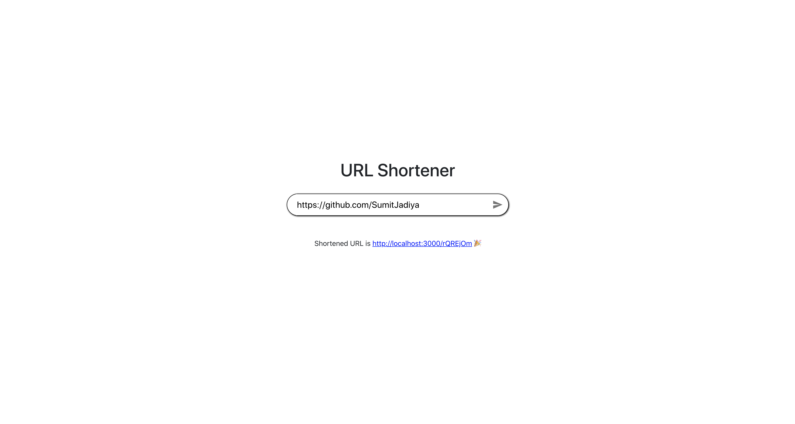

# Getting Started with URL Shortner App

 

This app encodes the long URL(provided in input box) to 7 character string.

 

Homepage.

 
 

When User tries to click without providing any input.

 
 

when user provides valid image url to shorten.

